KeyCloak
---------
keycloak is a open source IAM, this offer authorization how SSO, social login and others , for more information visit
the oficial documentation. http://https://www.keycloak.org[KeyCloak]

Instalation
^^^^^^^^^^^
* Install docker image
+
[source,python]
-----------------
docker run jboss/keycloak
-----------------
* Run docker with user administrator
+
[source,python]
-----------------
docker run -p 8080:8080 -e KEYCLOAK_USER=admin -e KEYCLOAK_PASSWORD=admin jboss/keycloak
-----------------

Create realm
^^^^^^^^^^^^^
http://localhost:8080/auth
Login

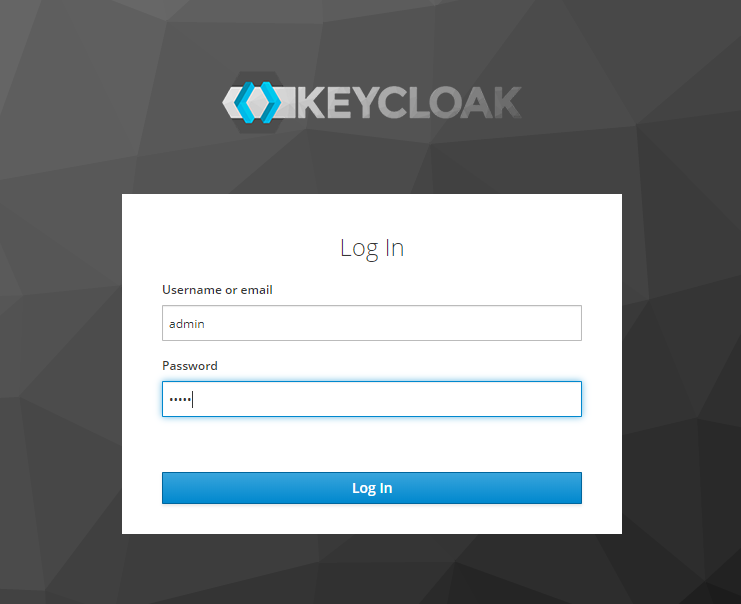

Create Realm

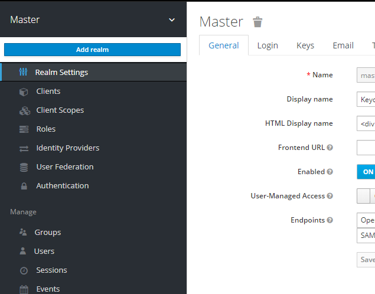

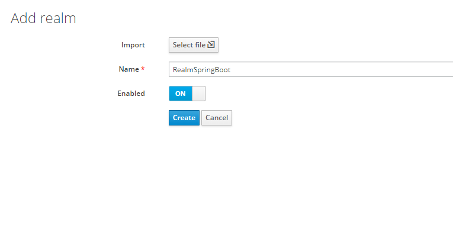

Create Client
^^^^^^^^^^^^^
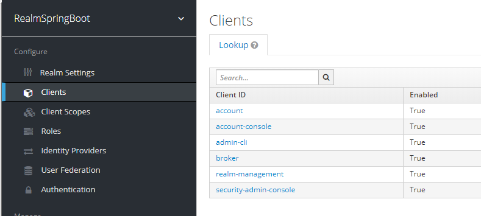

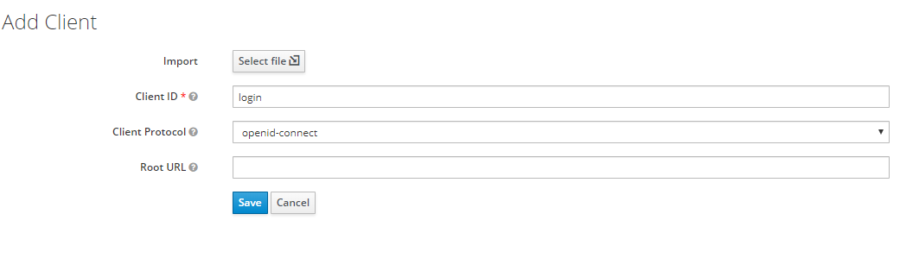

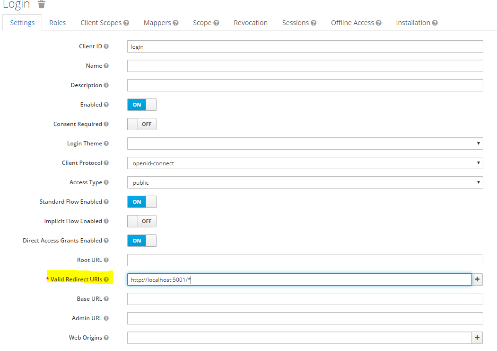

Create role
^^^^^^^^^^^
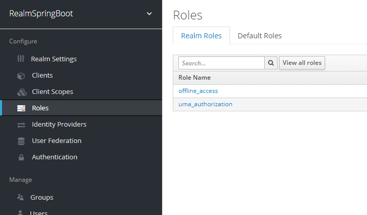

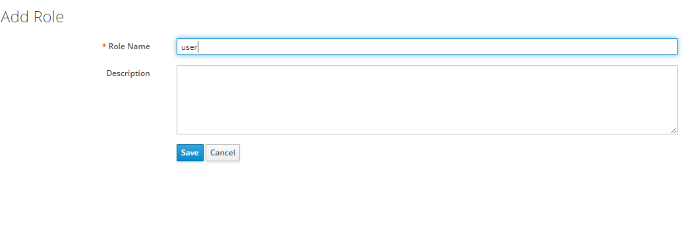

Create user
^^^^^^^^^^^
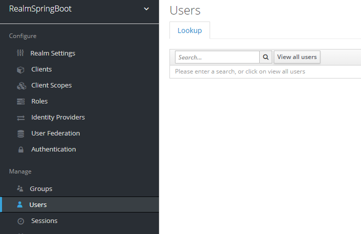

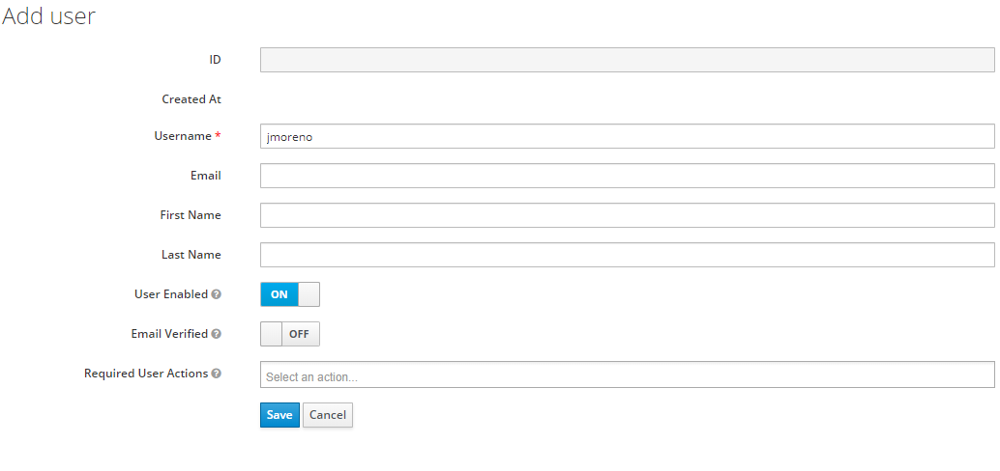

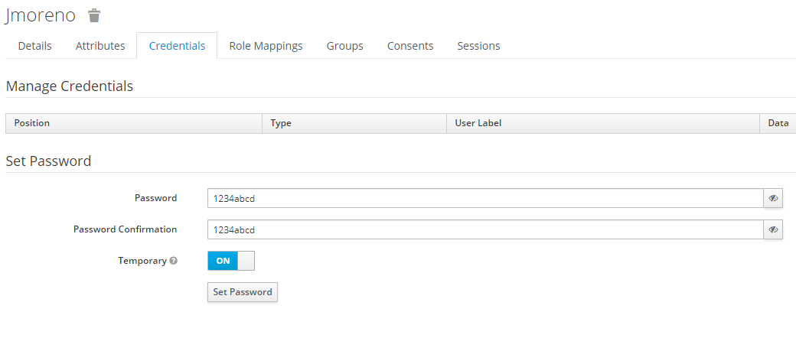

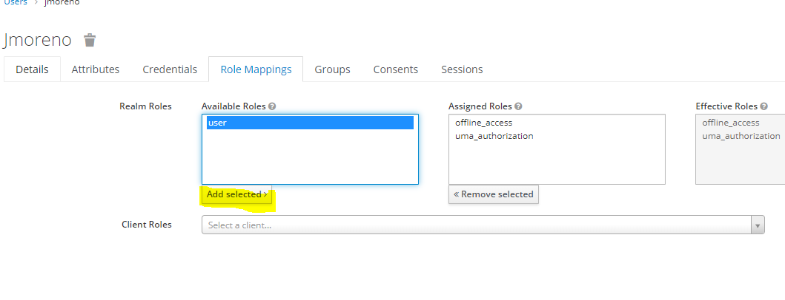

Activate User
^^^^^^^^^^^^

http://localhost:8080/auth/realms/RealmSpringBoot/account/applications

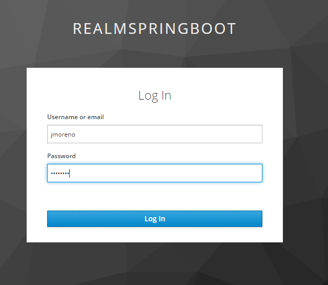

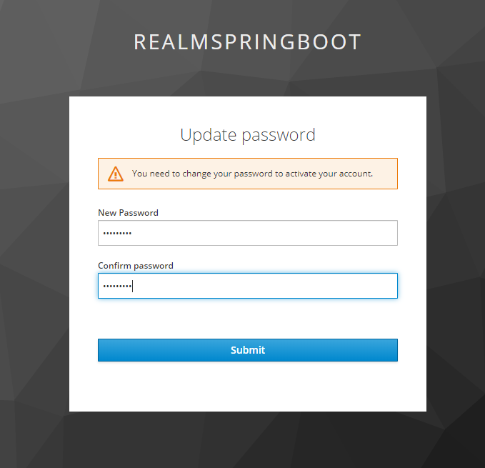

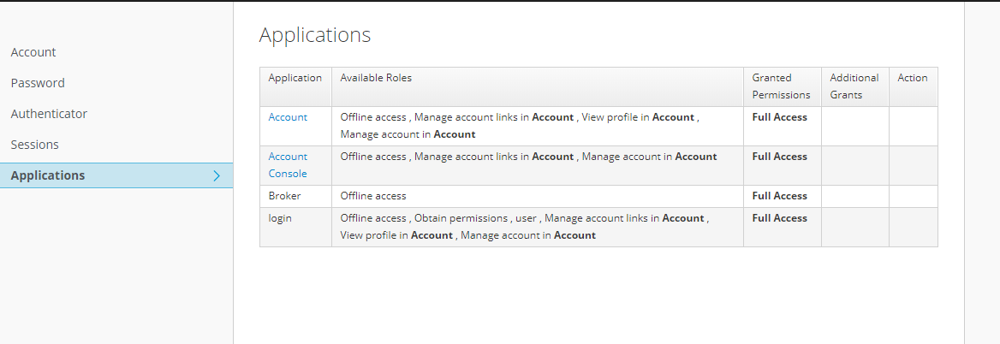

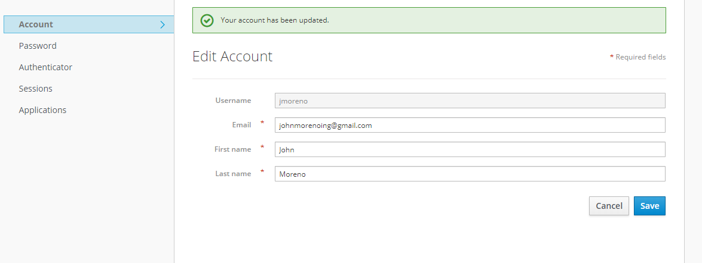

Test User
^^^^^^^^^

[source,python]
-----------------
curl -X POST   -d "client_id=login"   -d "username=jmoreno"   -d "password=12345abcd"   -d "grant_type=password"
  "http://localhost:8080/auth/realms/RealmSpringBoot/protocol/openid-connect/token"
-----------------
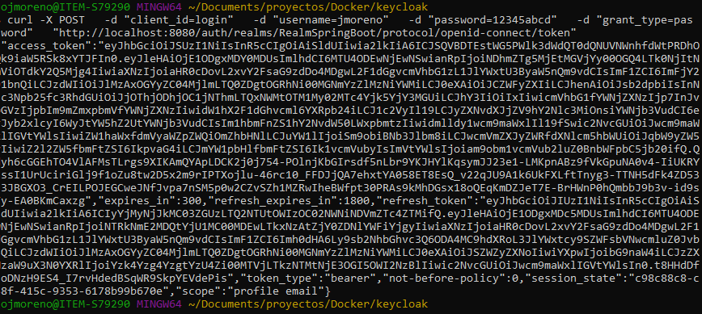

